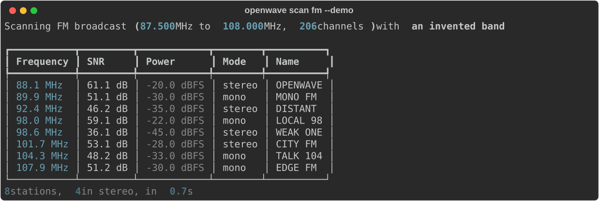
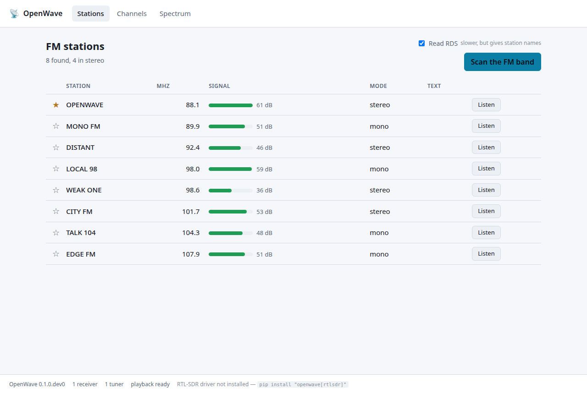
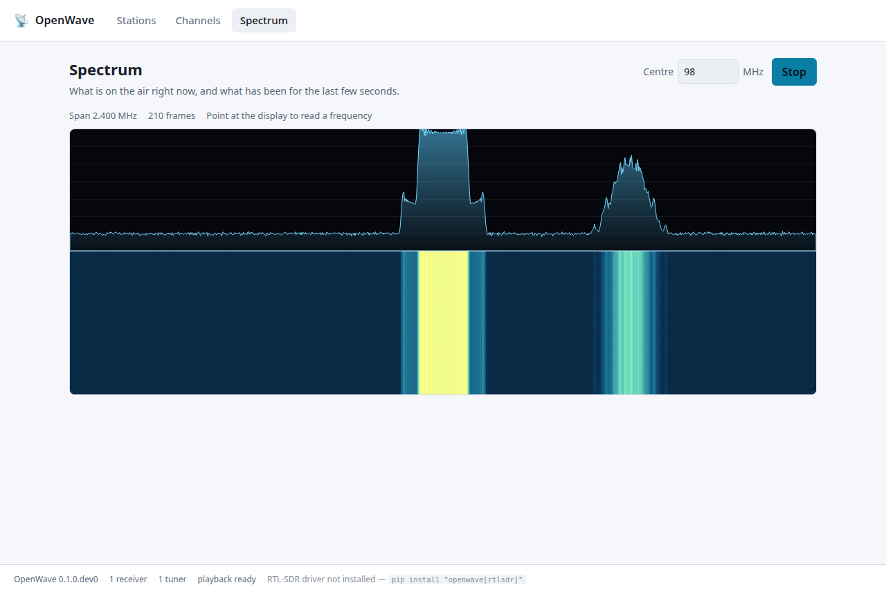
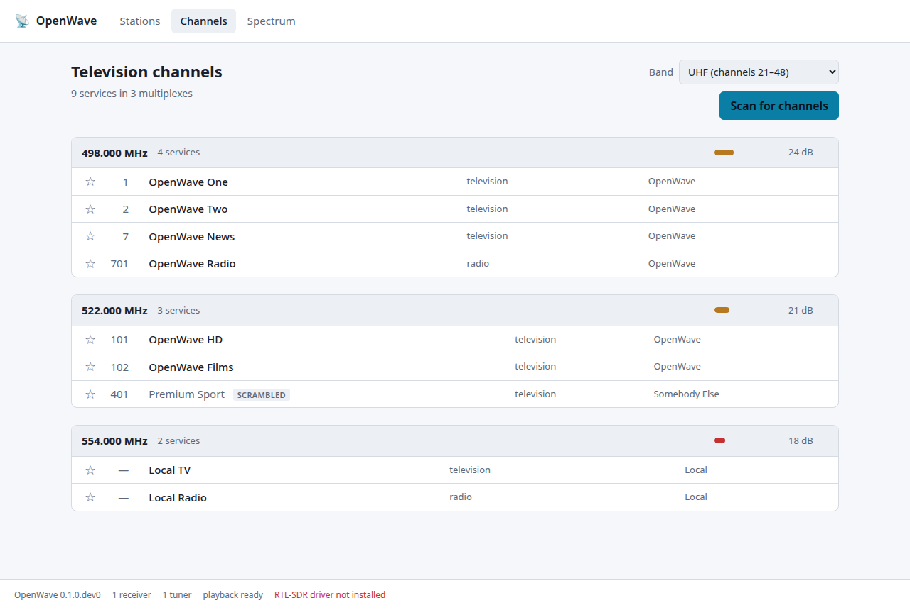

# 📡 OpenWave

> Projet open source de détection, analyse et lecture des diffusions radio et TV accessibles publiquement.

[](https://github.com/Mxlione/Openwave/actions/workflows/ci.yml)


*Version anglaise : [README.md](README.md).*

OpenWave n'est pas un simple lecteur VLC. C'est une plateforme capable de **scanner les
fréquences**, **détecter les services disponibles** (stations FM, chaînes TV) et **les présenter à
l'utilisateur** dans une interface claire, prêts à être écoutés ou regardés.

---

## 📸 À quoi ça ressemble

Un scan de la bande simulée, sans aucun récepteur branché. Chaque image vient d'une exécution
réelle du programme : `scripts/capture_cli.py` et `scripts/capture_interface.py` les regénèrent.



| | |
|---|---|
|  |  |
| Les stations trouvées par un scan, avec signal, mode et nom RDS | Le spectre et la cascade, en direct via WebSocket |



---

## 🎯 Objectifs

- Scanner automatiquement la bande FM et détecter les stations présentes
- Scanner les multiplex TV (DVB-T) et lister les chaînes et services
- Afficher la fréquence, la puissance du signal et le spectre
- Lancer l'écoute ou le visionnage en un clic grâce à libVLC
- Rester modulaire : un nouveau récepteur ou un nouveau format se branche sans toucher au reste

---

## ✨ Fonctionnalité centrale

L'utilisateur branche un récepteur compatible (RTL-SDR ou tuner DVB-T), lance un scan, puis choisit
ce qu'il veut écouter ou regarder.

```
RTL-SDR / tuner DVB-T
          ↓
      OpenWave
          ↓
       [SCAN]
          ↓
┌─────────────────────────┐
│ 📻 FM                   │
│  88.1 MHz   Station A   │
│  92.4 MHz   Station B   │
│ 100.7 MHz   Station C   │
│                         │
│ 📺 TV                   │
│ Canal 1                 │
│ Canal 2                 │
│ Canal 3                 │
└─────────────────────────┘
```

Un clic sur **Regarder** ou **Écouter** envoie le flux à libVLC.

---

## 🚦 État du projet

OpenWave est en développement initial. Rien n'est encore publié.

| Domaine | État |
|---|---|
| Dépôt, CI, guide de contribution | 🟢 en place |
| Couche d'abstraction matérielle (`sdr/`) | 🟢 en place |
| Récepteurs simulés (IQ synthétiques, rejeu MPEG-TS) | 🟢 en place |
| Scan de la bande FM (v0.1) | 🟢 en place |
| Démodulation FM et écoute (v0.2) | 🟢 en place |
| Décodage RDS (v0.3) | 🟢 en place |
| Scan DVB-T (v0.4) | 🟢 en place |
| API HTTP (v0.5) | 🟢 en place |
| Interface Angular (v0.6) | 🟢 en place |
| Spectre temps réel (v0.7) | 🟢 en place |
| Site de documentation et packaging (v1.0) | 🟢 en place |
| Validation sur du matériel réel | 🔴 personne n'a essayé |

**Point d'honnêteté sur le matériel.** Le mainteneur ne dispose pour l'instant ni de clé RTL-SDR ni
de tuner DVB-T. Chaque étape de traitement du signal est donc développée et testée contre des
**récepteurs simulés** — IQ synthétiques pour la FM et le RDS, flux de transport enregistrés pour le
DVB-T — qui tournent en CI à chaque commit. Les drivers réels sont écrits d'après les API des
bibliothèques mais ne sont **pas encore validés sur du matériel physique**. Si tu possèdes un
récepteur, valider un driver est la contribution la plus utile possible aujourd'hui : voir les
issues étiquetées `hardware validation`.

---

## 🏗️ Architecture générale

```
                       ┌──────────────────────┐
                       │      OPENWAVE        │
                       │  Projet OPEN SOURCE  │
                       └──────────┬───────────┘
                                  │
                            📡 ANTENNE
                                  │
                   ┌──────────────┴──────────────┐
                   │                             │
              📻 FM RADIO                    📺 TV
                   │                             │
           ┌───────▼───────┐             ┌───────▼──────┐
           │   SDR / FM    │             │ Tuner DVB /  │
           │    Tuner      │             │     SDR      │
           └───────┬───────┘             └───────┬──────┘
                   │                             │
                   ▼                             ▼
            🔎 Détection FM              📦 Multiplex TV (MUX)
                   │                             │
                   ▼                             ▼
           ┌───────────────┐             🔎 Détection des
           │ Fréquence     │             chaînes / services
           │ Puissance     │                     │
           │ Stéréo        │                     ▼
           │ RDS*          │             ┌───────────────┐
           └───────┬───────┘             │ TV 1 · TV 2   │
                   │                     │ TV 3 · Radio 1│
                   ▼                     └───────┬───────┘
              🎵 AUDIO                           │
                   │                             │
                   └──────────────┬──────────────┘
                                  ▼
                       ┌──────────────────────┐
                       │   MEDIA PROCESSING   │
                       │  FFmpeg / codecs     │
                       │  libVLC              │
                       └──────────┬───────────┘
                                  ▼
                       ┌──────────────────────┐
                       │     OPENWAVE UI      │
                       │ 📻 Stations FM       │
                       │ 📺 Chaînes TV        │
                       │ 📊 Signal / fréquence│
                       │ 📡 Spectre           │
                       │ ⭐ Favoris           │
                       └──────────┬───────────┘
                                  ▼
                           ▶️ VLC / libVLC
                                  ▼
                       🎧 Audio  /  📺 Vidéo
```

\* RDS : nom de la station et informations transmises avec le signal FM.

---

## 🧩 Organisation des sources

```
OpenWave/
│
├── src/openwave/
│   ├── core/              # Moteur de scan
│   │   ├── scanner.py
│   │   ├── frequency_manager.py
│   │   ├── signal_detector.py
│   │   └── service_discovery.py
│   │
│   ├── radio/             # Radio FM
│   │   ├── fm_demodulator.py
│   │   ├── listener.py
│   │   ├── station_detector.py
│   │   ├── synthesis.py   # Émissions synthétiques, pour tester sans matériel
│   │   └── rds/           # RDS : blocs, groupes, encodeur, décodeur
│   │
│   ├── tv/                # Télévision numérique
│   │   ├── band.py        # Plans de canaux UHF et VHF
│   │   ├── dvb_scanner.py
│   │   ├── mux_parser.py
│   │   ├── psi.py         # Sections PSI, leur CRC et leur réassemblage
│   │   ├── service_parser.py
│   │   ├── synthesis.py   # Multiplex synthétiques, pour tester sans tuner
│   │   ├── tables.py      # PAT, PMT, SDT, NIT
│   │   └── ts.py          # Le paquet de transport de 188 octets
│   │
│   ├── sdr/               # Accès aux récepteurs
│   │   ├── device.py      # Interfaces SdrDevice / DvbDevice
│   │   ├── rtl_sdr.py
│   │   ├── soapy_sdr.py
│   │   ├── mock.py        # Récepteurs simulés utilisés par les tests
│   │   └── device_manager.py
│   │
│   ├── media/             # Traitement et lecture
│   │   ├── libvlc.py
│   │   ├── stream.py
│   │   └── wav.py
│   │
│   ├── api/               # API HTTP + WebSocket
│   │   ├── app.py         # Routes, servies sous /api/v1
│   │   ├── models.py      # Formes des requêtes et des réponses
│   │   ├── scans.py       # Les scans comme tâches de fond
│   │   └── streams.py     # Audio sur HTTP
│   │
│   └── cli.py             # Ligne de commande `openwave`
│
├── frontend/              # Interface Angular
├── tests/
└── docs/
    ├── architecture.md
    └── legal.md
```

| Module | Rôle |
|---|---|
| `core` | Balaye les fréquences, mesure le signal, détecte et regroupe les services trouvés |
| `radio` | Démodule la FM, décode le RDS, identifie les stations |
| `tv` | Scanne les canaux DVB, lit les multiplex et en extrait les chaînes |
| `sdr` | Isole le matériel derrière une interface commune (RTL-SDR, SoapySDR, DVB, simulé) |
| `media` | Transforme les flux avec FFmpeg et les lit avec libVLC |
| `api` | Expose le scan, les stations, les chaînes et les flux à l'interface |
| `frontend` | Interface Angular : liste, signal, spectre, favoris |

---

## 🧰 Technologies

- **Récepteurs** : RTL-SDR, tuners DVB-T, autres SDR via SoapySDR
- **Traitement du signal** : NumPy / SciPy — démodulation FM, décodage RDS, analyse de spectre
- **Média** : libVLC via `python-vlc`, qui tire un flux live par callbacks
- **API** : FastAPI, service local exposant les résultats du scan et les flux
- **Interface** : Angular

---

## 🗺️ Feuille de route

- [ ] **v0.1** — scan de la bande FM et détection des stations (fréquence, puissance)
- [ ] **v0.2** — démodulation FM et écoute via libVLC
- [ ] **v0.3** — décodage RDS (nom de station, RadioText)
- [ ] **v0.4** — scan DVB-T, lecture des multiplex et liste des chaînes
- [ ] **v0.5** — API stable (`scan`, `stations`, `channels`, `streams`)
- [ ] **v0.6** — interface Angular (liste, favoris, signal)
- [ ] **v0.7** — visualisation du spectre en temps réel
- [x] **v1.0** — documentation complète, packaging pour Linux

Le découpage détaillé en tâches se trouve dans [TASKS.md](TASKS.md).

---

## 🌍 Pourquoi « OpenWave » ?

- **Open** : open source, transparent, extensible
- **Wave** : ondes radio, signaux, audio et transmission

Un nom court, technologique, assez large pour couvrir la FM, la TV et le SDR.

---

## ⚖️ Cadre d'usage

OpenWave est conçu pour recevoir des **diffusions publiques et libres d'accès**. Il ne vise pas à
contourner des protections, des chiffrements ou des services payants. Vérifie la réglementation
locale sur la réception radioélectrique avant utilisation. Voir [docs/legal.md](docs/legal.md).

---

## 📚 Documentation

La documentation est en anglais, comme le reste du dépôt.

| | |
|---|---|
| [Installing](docs/installing.md) | Ce qu'il faut installer, et ce que chaque extra apporte |
| [Using OpenWave](docs/using.md) | Du premier scan à l'écoute d'une station |
| [Command line](docs/cli.md) | Toutes les commandes et options |
| [HTTP API](docs/api.md) | Routes, WebSockets, et le schéma généré |
| [Hardware](docs/hardware.md) | Brancher un récepteur, droits d'accès, dépannage |
| [Compatibility](docs/compatibility.md) | Les récepteurs dont on sait qu'ils marchent |
| [Architecture](docs/architecture.md) | Comment les morceaux s'assemblent, et pourquoi |
| [Signals](docs/signals.md) | La radio et le traitement du signal derrière le code |
| [Contributing](docs/contributing.md) | Installation, vérifications, règles |

`mkdocs serve` la sert comme un site.

---

## 🤝 Contribuer

Le projet démarre et toutes les contributions sont bienvenues : code, tests avec du matériel réel,
documentation, traductions, idées.

**La contribution la plus utile est de faire tourner OpenWave sur un vrai récepteur et de dire ce
qui s'est passé**, même si ça a planté. Personne ne l'a fait. Voir
[la matrice de compatibilité](docs/compatibility.md) pour ce qui est connu et ce qui ne l'est pas.

Lis [CONTRIBUTING.md](CONTRIBUTING.md) pour installer l'environnement, puis cherche l'étiquette
[`good first issue`](https://github.com/Mxlione/Openwave/labels/good%20first%20issue).

---

## 📄 Licence

MIT — voir [LICENSE](LICENSE).
